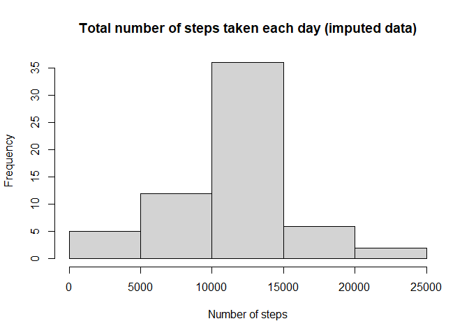
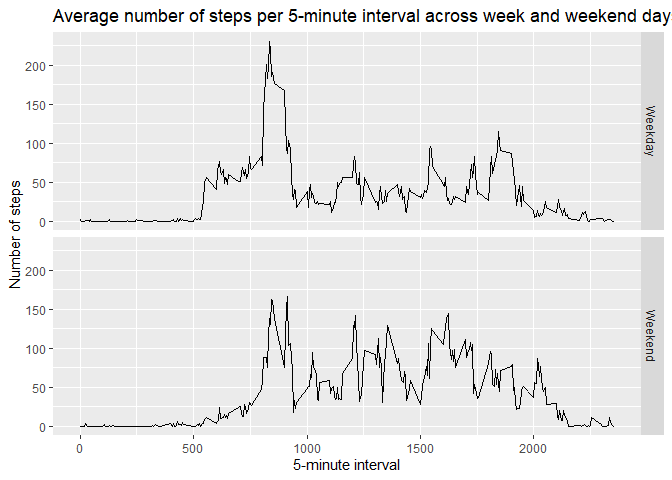

## Loading and preprocessing the data  

#### 1. Load the data (i.e. read.csv())  

```r
library(dplyr)
```

```
## Warning: package 'dplyr' was built under R version 4.0.4
```

```
## 
## Attaching package: 'dplyr'
```

```
## The following objects are masked from 'package:stats':
## 
##     filter, lag
```

```
## The following objects are masked from 'package:base':
## 
##     intersect, setdiff, setequal, union
```

```r
library(ggplot2)
data <- read.csv(unz("activity.zip", "activity.csv"), header = TRUE) 
```

#### 2. Process/transform the data (if necessary) into a format suitable for your analysis  

```r
data$date <- as.Date(data$date, "%Y-%m-%d")
```


## What is mean total number of steps taken per day?

#### 1. Make a histogram of the total number of steps taken each day

A **histogram** of the total number of steps taken each day is displayed below: 


```r
# group data by day and calculate total of steps per day
data_by_day <- data %>% dplyr::group_by(date) %>% dplyr::summarize(sum_day =  sum(steps, na.rm = TRUE))

#plot histogram of total steps per day
with(data = data_by_day, hist(sum_day, main = "Total number of steps taken each day", 
                                            xlab = "Number of steps"))
```

<!-- -->

#### 2. Calculate and report the mean and median total number of steps taken per day

```r
# calculate the mean and median of the total number of steps taken per day
sum_day_mean <- round(mean(data_by_day$sum_day),2)
sum_day_median <- median(data_by_day$sum_day)
```

The **mean** of the total number of steps taken per day equals **9354.23** and the **median** of the total number of steps taken per day equals **10395.**

## What is the average daily activity pattern?

#### 1. Make a time series plot (i.e. type = "l") of the 5-minute interval (x-axis) and the average number of steps taken, averaged across all days (y-axis)

A **time series plot** of the 5-minute interval (x-axis) and the average number of steps taken, averaged across all days (y-axis) is displayed below: 


```r
# group data by interval and calculate the average number of steps taken, averaged across all days (y-axis)
data_by_interval <- data %>% dplyr::group_by(interval) %>% dplyr::summarize(mean_steps =  mean(steps, na.rm = TRUE))

# time series plot of the 5-minute interval and the average number of steps taken, averaged across all days
with(data_by_interval, plot(x = interval, y = mean_steps, type = "l", 
                            main = "Average number of steps taken per 5-minute interval across all days",
                            xlab = "5-minute interval",
                            ylab = "Number of steps"))
```

<!-- -->

#### 2. Which 5-minute interval, on average across all the days in the dataset, contains the maximum number of steps?

```r
max_interval <- data_by_interval$interval[which.max(data_by_interval$mean_steps)]
```


The 5-minute interval that on average across all the days in the dataset, contains the **maximum number** of steps is **interval N°835.**


## Imputing missing values

#### 1. Calculate and report the total number of missing values in the dataset (i.e. the total number of rows with NAs)

```r
NA_steps <- sum(is.na(data))
```

The total **number of missing values** in the dataset equals **2304.**

#### 2. Devise a strategy for filling in all of the missing values in the dataset. The strategy does not need to be sophisticated. For example, you could use the mean/median for that day, or the mean for that 5-minute interval, etc. 

#### 3. Create a new dataset that is equal to the original dataset but with the missing data filled in.

```r
#both 2 and 3 are achieved with the code below:

#generates a copy of the data in which to add the imputed data
imputed_data <- data
#add imputed interval mean through a for loop using the data_by_interval data frame created before 
for (i in 1:nrow(imputed_data)) {
    if (is.na(imputed_data$steps[i])) {
        imputed_data$steps[i] <- data_by_interval[(which(imputed_data$interval[i] == data_by_interval$interval)),]$mean_steps
    }
}
```

#### 4. Make a histogram of the total number of steps taken each day and Calculate and report the mean and median total number of steps taken per day. Do these values differ from the estimates from the first part of the assignment? What is the impact of imputing missing data on the estimates of the total daily number of steps?

A **histogram** of the total number of steps taken each day using the imputed data is displayed below: 


```r
# group data by day and calculate total of steps per day
data_by_day_imputed <- imputed_data %>% dplyr::group_by(date) %>% 
  dplyr::summarize(sum_day =  sum(steps, na.rm = TRUE))

#plot histogram of total steps per day
with(data = data_by_day_imputed, hist(sum_day, 
                                main = "Total number of steps taken each day (imputed data)",
                                xlab = "Number of steps"))
```

<!-- -->

```r
# calculate the mean and median of the total number of steps taken per day
sum_day_mean_imputed <- round(mean(data_by_day_imputed$sum_day),2)
sum_day_median_imputed <- round(median(data_by_day_imputed$sum_day),2)
options(scipen=999) # to avoid scientific notation
```

The **mean** of the total number of steps taken per day equals **10766.19** and the **median** of the total number of steps taken per day equals **10766.19**. The new estimates for the total daily number of steps differ slightly from the non-imputed data estimates, with a larger difference between the means than between the medians.


## Are there differences in activity patterns between weekdays and weekends?

A panel plot containing a **time series plot** of the 5-minute interval and the average number of steps taken, averaged **across all weekday days or weekend days** is displayed below: 

#### 1. Create a new factor variable in the dataset with two levels -- "weekday" and "weekend" indicating whether a given date is a weekday or weekend day.

```r
imputed_data$day <- weekdays(imputed_data$date)

for (i in 1:nrow(imputed_data)) {
        if (imputed_data$day[i] %in% c("Saturday", "Sunday")) {imputed_data$day[i] <- "Weekend"}
        else {imputed_data$day[i] <- "Weekday"}
}
```

#### 2. Make a panel plot containing a time series plot (i.e. type = "l") of the 5-minute interval (x-axis) and the average number of steps taken, averaged across all weekday days or weekend days (y-axis). The plot should look something like the following, which was created using simulated data:

```r
# group data by interval and calculate the average number of steps taken, averaged across all days (y-axis)
data_by_interval_day_imputed <- imputed_data %>% 
  dplyr::group_by(day, interval) %>% 
  dplyr::summarize(mean_steps =  mean(steps, na.rm = TRUE))
```

```
## `summarise()` has grouped output by 'day'. You can override using the `.groups` argument.
```

```r
#panel plot
ggplot(data = data_by_interval_day_imputed, aes(x = interval, y = mean_steps)) + 
  geom_line() + 
  facet_grid(day~.) +
  labs(title = "Average number of steps per 5-minute interval across week and weekend days",
       x = "5-minute interval",
       y = "Number of steps")
```

<!-- -->

The plot shows that **activities start earlier and are more intense in the morning during weekdays** in comparison to weekend days, however it **appears that people are more active during the rest of the day in the weekend** as the average number of steps is overall higher than during the weekdays.
